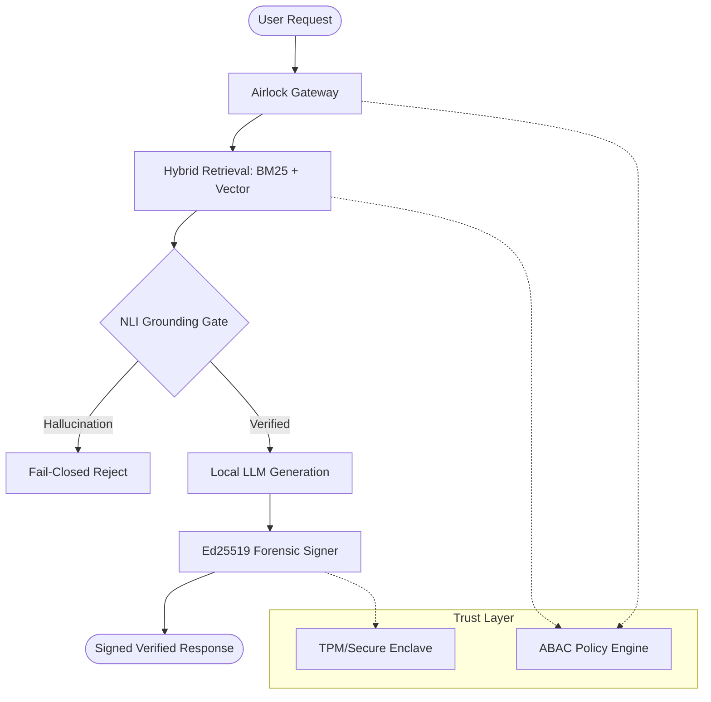

# Anandakrishnan Damodaran

### Sovereign AI Architect | Building Technically-Verifiable AI Infrastructure

I build systems for **high-trust AI**: deterministic orchestration, policy enforcement, and cryptographically-verifiable forensics. 

My work focuses on replacing unreliable "Generative Judges" with **deterministic NLI Cross-Encoders** and basic hash chains with **Ed25519 asymmetric signatures**.

---

## 🛠️ Flagship Projects

### 🛰️ [Sovereign AI Stack](https://github.com/anandkrshnn/sovereign-ai-stack)
**Deterministic RAG Verification & Governance**
The reference implementation for local-first AI that prioritizes grounding integrity over marketing hype.
- **Innovation**: Replaced slow LLM judges (~2000ms) with a **DeBERTa-v3 NLI gate (80ms)**.
- **Security**: Full **Ed25519 forensic chain** for non-repudiable audit trails.
- **Trust**: Hardware-backed key management (OS Keyring/TPM integration).

### 🛰️ [local-rag](https://github.com/anandkrshnn/sovereign-ai-stack)
The core retrieval engine for sovereign environments. Hybrid search (BM25 + Vector) with strict ABAC policy gating and signed forensics.

### 🛰️ [local-agent](https://github.com/anandkrshnn/local-agent)
A lightweight, auditable orchestration layer for local AI agents, focusing on fail-closed tool governance and tamper-evident execution logs.

---

## 🏛️ Core Principles

1.  **Verify then Trust**: No LLM output leaves the stack without NLI-based grounding verification.
2.  **Cryptographic Accountability**: Every retrieval and generation is signed by the host hardware (TPM/Enclave).
3.  **Local Supremacy**: Zero dependency on third-party cloud APIs for security-critical orchestration.
4.  **Fail-Closed Governance**: If the policy or grounding gate cannot be definitively satisfied, the system rejects the request.

---

## 🔬 Technical Focus Areas

- **Grounding Verification**: Using Natural Language Inference (NLI) for deterministic hallucination control.
- **Asymmetric Forensics**: Implementing Ed25519 signatures in audit logs to ensure non-repudiation.
- **Local-First Governance**: Policy enforcement (ABAC) at the retrieval and tool-call layers without external dependencies.
- **Hardware-Backed Trust**: Integrating with OS-level secure enclaves for identity and signature management.

---

## 🚀 Roadmap

- [ ] **v1.1.0**: Multi-tenant ABAC gating for shared local-first environments.
- [ ] **v1.2.0**: Direct integration with Linux TPM2.0 for Ed25519 key storage.
- [ ] **PTV Protocol**: Maturing the IETF draft with reference implementations in Rust and Python.

---

## 📜 Standards & Research

I am an advocate for open standards in AI identity and governance. 
- **IETF Draft**: [Attested Agent Identity (PTV)](https://datatracker.ietf.org/doc/draft-anandakrishnan-rats-ptv-agent-identity/)
- **Vision**: Transitioning AI governance from "Trust but Verify" to **"Verify then Trust."**

---

## 📬 Connect

- **LinkedIn**: [linkedin.com/in/anandkrshnn](https://www.linkedin.com/in/anandkrshnn)
- **Email**: [ananda.krishnan@hotmail.com](mailto:ananda.krishnan@hotmail.com)
- **PyPI**: [sovereign-ai-stack](https://pypi.org/project/sovereign-ai-stack/)

*Building for healthcare, finance, and high-stakes infrastructure where "good enough" AI isn't an option.*
